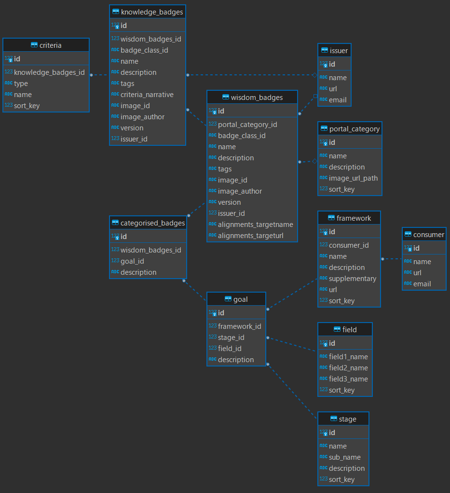

# アーキテクチャの概要

## 全体構成

## フレームワーク

### フロントエンド

#### [Next.js](https://nextjs.org/)

ウェブアプリケーションフレームワーク。

#### [Tailwind CSS](https://tailwindcss.com/)

CSSフレームワーク。

#### [Jumpu UI](https://github.com/tuqulore/jumpu-ui)

CSSフレームワークと協調するUIフレームワーク。一貫性のある見た目の実装に使用。

#### [Headless UI](https://headlessui.com/)

CSSフレームワークあるいはUIフレームワークと強調するヘッドレスUIフレームワーク。動的な振る舞いの実装に使用。

#### [Iconify](https://iconify.design/)

アイコンフレームワーク。

### バックエンド

## DBスキーマの全体像

## DBテーブル定義

https://github.com/npocccties/chiloportal/blob/develop/backend/sql/create_table.sql

## APIドキュメント

## Code Map

### frontend ([code](https://github.com/npocccties/chiloportal/tree/main/frontend), [docs](https://github.com/npocccties/chiloportal/tree/main/frontend#readme))

フロントエンドアプリケーションを提供するサーバー。[Next.js](https://nextjs.org/)で実行。

### frontend/components ([code](https://github.com/npocccties/chiloportal/tree/main/frontend/components))

Reactコンポーネント。

### frontend/contents ([code](https://github.com/npocccties/chiloportal/tree/main/frontend/contents))

静的なページとして表示するマークダウンファイル。詳細は[こちら](https://github.com/npocccties/chiloportal/tree/main/frontend#contentsmd-%E3%81%82%E3%82%8B%E3%81%84%E3%81%AF-overridescontentsmd)を参照してください。

### frontend/lib ([code](https://github.com/npocccties/chiloportal/tree/main/frontend/lib))

ユーティリティやヘルパー関数。補助的な機能の提供。

### frontend/mocks ([code](https://github.com/npocccties/chiloportal/tree/main/frontend/mocks))

バックエンドモックサーバー。[MSW](https://mswjs.io/)で実行。

### frontend/overrides ([code](https://github.com/npocccties/chiloportal/tree/main/frontend/overrides))

静的コンテンツの上書き。詳細は[こちら](https://github.com/npocccties/chiloportal/tree/main/frontend#%E4%B8%8A%E6%9B%B8%E3%81%8D)を参照してください。

### frontend/pages ([code](https://github.com/npocccties/chiloportal/tree/main/frontend/pages))

データフェッチ関数とReactコンポーネントをもとに作られる実体とそれらのルーティング。

### frontend/posts ([code](https://github.com/npocccties/chiloportal/tree/main/frontend/posts))

おしらせとして表示するマークダウンファイル。詳細は[こちら](https://github.com/npocccties/chiloportal/tree/main/frontend#postsmd-%E3%81%82%E3%82%8B%E3%81%84%E3%81%AF-overridespostsmd)を参照してください。

### frontend/public ([code](https://github.com/npocccties/chiloportal/tree/main/frontend/public))

画像など静的ファイルの提供。バッジ、コンシューマー、ポータルカテゴリーの画像を追加するには[能力バッジのインポート](https://github.com/npocccties/chiloportal/blob/main/INSTALL.md#%E8%83%BD%E5%8A%9B%E3%83%90%E3%83%83%E3%82%B8%E3%81%AE%E3%82%A4%E3%83%B3%E3%83%9D%E3%83%BC%E3%83%88%E6%99%82)をおこなってください。

### frontend/schemas ([code](https://github.com/npocccties/chiloportal/tree/main/frontend/schemas))

[JSON Schema](https://json-schema.org/)。バリデーションに使用。

### frontend/styles ([code](https://github.com/npocccties/chiloportal/tree/main/frontend/styles))

スタイルシート。

### frontend/templates ([code](https://github.com/npocccties/chiloportal/tree/main/frontend/templates))

[Atomic Design MethodologyにおけるTemplates](https://atomicdesign.bradfrost.com/chapter-2/#templates)。Reactコンポーネント。

### backend

### docs/assets ([code](https://github.com/npocccties/chiloportal/tree/main/docs/assets))

ドキュメント用の図の画像など静的ファイルのためのディレクトリ。
